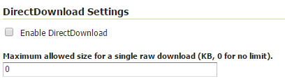
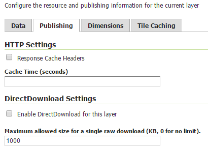

.. _directdownload:

DirectDownload
==============

DirectDownload is a new operation (since GeoServer 2.9.x) supported by the CSW service.

In the Metoc/EO world, layers are usually based on complex NetCDF/Grib files. Protocols such as WCS, are setup to allow slice, rescale, reproject data, but not exactly to preserve the original data as is.

This new operation allows to directly download the raw data for that layer.
In case the DirectDownload capability is enabled for a Coverage layer, the CSW record will be updated to contain links pointing back to the CSW service, 
to this vendor operation that will assemble the files for the requested resource, zip them, and send the result back to the requestor.

The download links (one for each data file composing the layer plus a link to get all the files composing the layer) are added as new entries in CSW records:

* as additional **term-references** element for a Dublin Core schema 
* as additional **OnlineResource** for ISO Metadata

That link also contains domain validity for that file such as envelope, time, elevation (and custom) dimensions for multidimensional layers.

Configuration
=============

DirectDownload capability can be activated as default for all layers, as global CSW configuration. Go into the CSW service panel and click on the *enable DirectDownload* checkbox if you want it 
enabled for all layers:

   *DirectDownload configuration (Service level)*

From this section you can also set a download limit value (0 means no limit). The specified value represents the maximum size of the sum of the sizes of the raw data referred by a single download link. 
(You can think about the download link referring to the whole layer data).
When saying *original* raw data we refer to the fact that the size check will be performed on the raw data files before applying the zip compression.

Per Layer configuration
=======================

DirectDownload capability can also be enabled/disabled for a specific layer, resulting in overriding the global CSW configuration. 

Go to the *publishing* tab of the layer where you can find the *DirectDownload settings* section. 

   *DirectDownload configuration (Layer level)*
   
The configuration of this parameters follows the same rules explained before for the CSW configuration panel.  